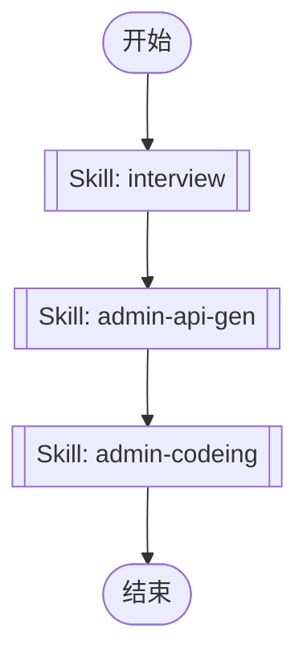

# Admin Development Workflow Orchestration

This skill orchestrates the complete admin dashboard development workflow. It automates the process from requirement clarification to API client generation and page implementation for admin management systems.

## Workflow Overview

The admin development process follows these sequential steps:



## Execution Steps

Execute each skill in sequence using the Skill tool. Each step must complete successfully before proceeding to the next.

### Step 0: Requirement Clarification (interview)

Conduct discovery conversation to understand user intent and agree on approach before implementation.

**Purpose**: Clarify requirements, understand feature scope, and agree on implementation approach.

Execute:
```
Skill tool with skill="interview"
```

**Key Questions to Clarify**:
- What admin pages need to be created?
- What CRUD operations are required?
- What backend APIs need to be integrated?
- What forms and tables are needed?
- What permissions and access control are required?
- What UI components and interactions are needed?

### Step 1: API Client Generation (admin-api-gen)

Generate TypeScript API client code from backend Swagger documentation.

**Purpose**: Create type-safe API client code for backend integration.

**Allowed Tools**: Bash, Read, Glob

Execute:
```
Skill tool with skill="admin-api-gen"
```

**When to Execute**:
- Backend API has been updated and needs synchronization
- New API endpoints have been added
- Need to refresh/regenerate API type definitions

### Step 2: Page Implementation (admin-codeing)

Implement admin dashboard pages with forms, tables, and CRUD functionality.

**Purpose**: Create admin pages, integrate backend APIs, and implement complete frontend features.

Execute:
```
Skill tool with skill="admin-codeing"
```

**Implementation Includes**:
- Creating new admin management pages
- Implementing forms and tables
- Integrating backend APIs
- Permission control implementation
- Component encapsulation
- Complete frontend CRUD functionality

## Execution Guidelines

1. **Sequential Execution**: Execute skills in the exact order shown above. Do not skip steps unless there's a clear reason.

2. **Interview First**: Always start with the interview skill to clarify requirements before implementation. This prevents building the wrong thing.

3. **API Generation**: If backend APIs are needed, generate the API client before implementing pages. This ensures type-safe API integration.

4. **Error Handling**: If any step fails, stop the workflow and report the error to the user. Do not proceed to subsequent steps.

5. **Progress Tracking**: Use TodoWrite to track progress through the workflow steps.

6. **Skill Invocation**: Use the Skill tool to invoke each skill:
   ```
   Skill tool with skill="<skill-name>"
   ```

## When to Use This Skill

Use this skill when:
- Developing admin dashboard pages
- Creating forms and tables for admin management
- Need complete frontend CRUD functionality
- User requests admin management features
- Starting a new admin feature from scratch
- Implementing permission-controlled admin pages

## When NOT to Use This Skill

Do not use this skill when:
- Only need to modify a single file or make small changes
- Only need to run one specific admin skill (use that skill directly)
- User explicitly requests a specific step only
- Working on non-admin or non-management pages

## Common Use Cases

- **User Management**: Create, read, update, delete user records
- **Content Management**: Manage articles, products, or other content
- **System Configuration**: Admin settings and configuration pages
- **Data Tables**: List views with filtering, sorting, and pagination
- **Form Pages**: Create and edit forms with validation
- **Permission Control**: Role-based access control implementation
