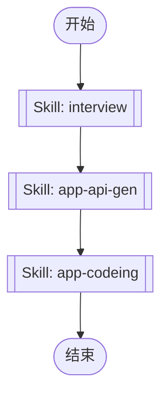

# App Development Workflow Orchestration

This skill orchestrates the complete mobile app development workflow for uni-app applications. It automates the process from requirement clarification to API client generation and page implementation.

## Workflow Overview

The app development process follows these sequential steps:



## Execution Steps

Execute each skill in sequence using the Skill tool. Each step must complete successfully before proceeding to the next.

### Step 0: Requirement Clarification (interview)

Conduct discovery conversation to understand user intent and agree on approach before implementation.

**Purpose**: Clarify requirements, understand feature scope, and agree on implementation approach.

Execute:
```
Skill tool with skill="interview"
```

**Key Questions to Clarify**:
- What pages need to be created?
- What features and functionality are required?
- What backend APIs need to be integrated?
- What UI components and interactions are needed?
- What data needs to be displayed and managed?

### Step 1: API Client Generation (app-api-gen)

Generate TypeScript API client code from backend Swagger documentation.

**Purpose**: Create type-safe API client code for backend integration.

**Allowed Tools**: Bash, Read, Glob

Execute:
```
Skill tool with skill="app-api-gen"
```

**When to Execute**:
- Backend API has been updated and needs synchronization
- New API endpoints have been added
- Need to refresh/regenerate API type definitions

### Step 2: Page Implementation (app-codeing)

Implement mobile pages with uni-app framework and wot-design-uni components.

**Purpose**: Create mobile pages, forms, lists, and integrate with backend APIs.

Execute:
```
Skill tool with skill="app-codeing"
```

**Implementation Includes**:
- Creating new pages and routes
- Implementing forms and lists
- Integrating backend APIs
- State management
- Component usage and customization
- Complete mobile app feature development

## Execution Guidelines

1. **Sequential Execution**: Execute skills in the exact order shown above. Do not skip steps unless there's a clear reason.

2. **Interview First**: Always start with the interview skill to clarify requirements before implementation. This prevents building the wrong thing.

3. **API Generation**: If backend APIs are needed, generate the API client before implementing pages. This ensures type-safe API integration.

4. **Error Handling**: If any step fails, stop the workflow and report the error to the user. Do not proceed to subsequent steps.

5. **Progress Tracking**: Use TodoWrite to track progress through the workflow steps.

6. **Skill Invocation**: Use the Skill tool to invoke each skill:
   ```
   Skill tool with skill="<skill-name>"
   ```

## When to Use This Skill

Use this skill when:
- Developing uni-app mobile pages
- Creating forms and lists for mobile app
- Need complete mobile app feature development
- User requests mobile app functionality
- Starting a new mobile feature from scratch

## When NOT to Use This Skill

Do not use this skill when:
- Only need to modify a single file or make small changes
- Only need to run one specific app skill (use that skill directly)
- User explicitly requests a specific step only
- Working on non-mobile or non-uni-app projects

## Technology Stack

- **Framework**: uni-app (Vue-based cross-platform framework)
- **UI Components**: wot-design-uni
- **Language**: TypeScript
- **API Integration**: Type-safe API client generated from Swagger
