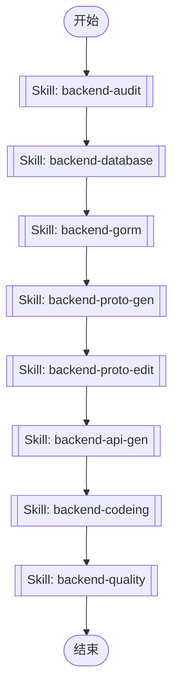

# Backend Development Workflow Orchestration

This skill orchestrates the complete backend development workflow by executing a sequence of specialized skills in order. It automates the entire process from initial audit to final quality checks.

## Workflow Overview

The backend development process follows these sequential steps:



## Execution Steps

Execute each skill in sequence using the Skill tool. Each step must complete successfully before proceeding to the next.

### Step 0: Backend Audit (backend-audit)

Validate development prerequisites and audit existing artifacts to determine the starting point.

**Purpose**: Check if tables/APIs already exist and determine which steps can be skipped.

**Allowed Tools**: Read, Glob, Grep, mcp__dbhub__search_objects

Execute:
```
Skill tool with skill="backend-audit"
```

### Step 1: Database Design (backend-database)

Design or modify PostgreSQL database tables.

**Purpose**: Create new tables or modify existing table structures.

**Allowed Tools**: Read, Write, Glob, mcp__dbhub__execute_sql, mcp__dbhub__search_objects

Execute:
```
Skill tool with skill="backend-database"
```

### Step 2: GORM Code Generation (backend-gorm)

Generate GORM models, DAO, and Repository code from database tables.

**Purpose**: Create Go data access layer code based on database schema.

**Allowed Tools**: Bash, Read, Glob

Execute:
```
Skill tool with skill="backend-gorm"
```

### Step 3: Proto Generation (backend-proto-gen)

Generate Protobuf API definitions from database tables using sqltopb.

**Purpose**: Automatically create Proto files for gRPC/HTTP API definitions. Manual creation is prohibited.

**Allowed Tools**: Bash, Read, Glob

Execute:
```
Skill tool with skill="backend-proto-gen"
```

### Step 4: Proto Editing (backend-proto-edit)

Modify generated Proto files to add filters, validation rules, or business RPCs.

**Purpose**: Customize the generated Proto files for specific business requirements.

**Allowed Tools**: Read, Edit, Glob

Execute:
```
Skill tool with skill="backend-proto-edit"
```

### Step 5: API Code Generation (backend-api-gen)

Generate Go code (pb.go, grpc.pb.go, http.pb.go) from Proto files.

**Purpose**: Create API implementation code from Protobuf definitions.

**Allowed Tools**: Bash, Read, Glob

Execute:
```
Skill tool with skill="backend-api-gen"
```

### Step 6: Business Logic Implementation (backend-codeing)

Implement Service layer business logic and Data layer code.

**Purpose**: Write the actual business logic, error handling, and CRUD operations.

**Allowed Tools**: Read, Edit, Glob, Grep

Execute:
```
Skill tool with skill="backend-codeing"
```

### Step 7: Quality Checks (backend-quality)

Execute dependency injection, code formatting, linting, and validation.

**Purpose**: Ensure code quality and consistency before committing.

**Allowed Tools**: Bash, Read, Glob

Execute:
```
Skill tool with skill="backend-quality"
```

## Execution Guidelines

1. **Sequential Execution**: Execute skills in the exact order shown above. Do not skip steps unless the audit step indicates they can be skipped.

2. **Error Handling**: If any step fails, stop the workflow and report the error to the user. Do not proceed to subsequent steps.

3. **User Confirmation**: After the audit step, confirm with the user which steps need to be executed based on existing artifacts.

4. **Progress Tracking**: Use TodoWrite to track progress through the workflow steps.

5. **Skill Invocation**: Use the Skill tool to invoke each backend skill:
   ```
   Skill tool with skill="<skill-name>"
   ```

## When to Use This Skill

Use this skill when:
- User requests complete backend CRUD development
- Starting a new backend feature from scratch
- User says "帮我开发xxx后端功能" or similar requests
- Need to automate multiple backend development steps

## When NOT to Use This Skill

Do not use this skill when:
- Only need to modify a single file or make small changes
- Only need to run one specific backend skill (use that skill directly)
- User explicitly requests a specific step only
