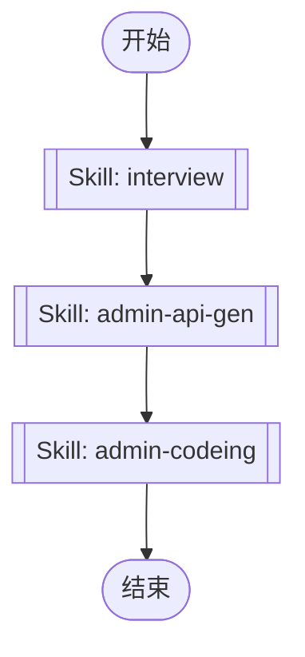

## 工作流执行指南

按照上方的Mermaid流程图执行工作流。每种节点类型的执行方法如下所述。

### 各节点类型的执行方法

- **矩形节点**：使用Task工具执行子代理
- **菱形节点（AskUserQuestion:...）**：使用AskUserQuestion工具提示用户并根据其响应进行分支
- **菱形节点（Branch/Switch:...）**：根据先前处理的结果自动分支（参见详细信息部分）
- **矩形节点（Prompt节点）**：执行下面详细信息部分中描述的提示

## Skill Nodes

#### skill_1768099887308(interview)

**Description**: This skill conducts discovery conversations to understand user intent and agree on approach before taking action. It should be used when the user explicitly calls /interview, asks for recommendations, needs exploration, wants to clarify, or when the request could be misunderstood. Prevents building the wrong thing by uncovering WHY behind WHAT.

**Scope**: project

**Validation Status**: valid

**Skill Path**: `.claude/skills/interview/SKILL.md`

This node executes a Claude Code Skill. The Skill definition is stored in the SKILL.md file at the path shown above.

#### skill_1768099899757(admin-api-gen)

**Description**: "Admin API 代码生成技能。从后端 Swagger 文件生成 TypeScript API 客户端代码。触发场景：(1) 后端 API 更新后需要同步 (2) 新增 API 接口后生成客户端代码 (3) 需要刷新/重新生成 API 类型定义"

**Scope**: project

**Validation Status**: valid

**Allowed Tools**: Bash, Read, Glob

**Skill Path**: `.claude/skills/admin-api-gen/SKILL.md`

This node executes a Claude Code Skill. The Skill definition is stored in the SKILL.md file at the path shown above.

#### skill_1768099911056(admin-codeing)

**Description**: Admin 管理后台开发技能。当用户需要开发前端页面、对接后端接口、实现 CRUD 功能时使用此技能。触发场景包括：(1) 新增管理页面 (2) 表单和表格开发 (3) API 接口对接 (4) 权限控制实现 (5) 组件封装 (6) 完整的前端功能开发流程

**Scope**: project

**Validation Status**: valid

**Skill Path**: `.claude/skills/admin-codeing/SKILL.md`

This node executes a Claude Code Skill. The Skill definition is stored in the SKILL.md file at the path shown above.
