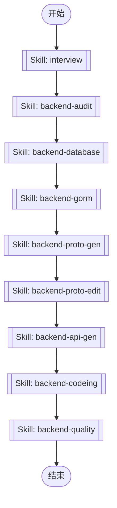

## 工作流执行指南

按照上方的Mermaid流程图执行工作流。每种节点类型的执行方法如下所述。

### 各节点类型的执行方法

- **矩形节点**：使用Task工具执行子代理
- **菱形节点（AskUserQuestion:...）**：使用AskUserQuestion工具提示用户并根据其响应进行分支
- **菱形节点（Branch/Switch:...）**：根据先前处理的结果自动分支（参见详细信息部分）
- **矩形节点（Prompt节点）**：执行下面详细信息部分中描述的提示

## Skill Nodes

#### skill_1768061082357(backend-audit)

**Description**: 后端开发前置审计技能。用于验证开发前置条件、审计现有工件状态、确定开发起点。触发场景：(1) 开始后端开发任务前 (2) 检查表/API 工件是否存在 (3) 确定从哪个步骤开始开发

**Scope**: project

**Validation Status**: valid

**Allowed Tools**: Read, Glob, Grep, mcp__dbhub__search_objects

**Skill Path**: `.claude/skills/backend-audit/SKILL.md`

This node executes a Claude Code Skill. The Skill definition is stored in the SKILL.md file at the path shown above.

#### skill_1768061100034(backend-database)

**Description**: PostgreSQL 数据库表设计技能。触发场景：(1) 创建新表 (2) 修改现有表 (3) 设计表关系 (4) 查询表结构

**Scope**: project

**Validation Status**: valid

**Allowed Tools**: Read, Write, Glob, mcp__dbhub__execute_sql, mcp__dbhub__search_objects

**Skill Path**: `.claude/skills/backend-database/SKILL.md`

This node executes a Claude Code Skill. The Skill definition is stored in the SKILL.md file at the path shown above.

#### skill_1768061131459(backend-gorm)

**Description**: 后端 GORM 代码生成技能。用于验证数据库表存在性并生成 GORM 模型、DAO、Repo 代码。触发场景：(1) 新建表后生成 GORM 代码 (2) 表结构变更后重新生成 (3) 检查 GORM 工件状态

**Scope**: project

**Validation Status**: valid

**Allowed Tools**: Bash, Read, Glob

**Skill Path**: `.claude/skills/backend-gorm/SKILL.md`

This node executes a Claude Code Skill. The Skill definition is stored in the SKILL.md file at the path shown above.

#### skill_1768061149184(backend-proto-gen)

**Description**: 后端 Protobuf 定义生成技能。用于从 SQL 表结构自动生成 Proto 文件。触发场景：(1) 新表需要生成 API 定义 (2) 表结构变更后重新生成 Proto

**Scope**: project

**Validation Status**: valid

**Allowed Tools**: Bash, Read, Glob

**Skill Path**: `.claude/skills/backend-proto-gen/SKILL.md`

This node executes a Claude Code Skill. The Skill definition is stored in the SKILL.md file at the path shown above.

#### skill_1768061165253(backend-proto-edit)

**Description**: 后端 Protobuf API 编辑技能。用于修改生成的 Proto 文件，添加过滤器、验证规则或业务 RPC。触发场景：(1) 需要添加列表过滤条件 (2) 调整验证规则 (3) 添加/删除 RPC 方法

**Scope**: project

**Validation Status**: valid

**Allowed Tools**: Read, Edit, Glob

**Skill Path**: `.claude/skills/backend-proto-edit/SKILL.md`

This node executes a Claude Code Skill. The Skill definition is stored in the SKILL.md file at the path shown above.

#### skill_1768061199804(backend-api-gen)

**Description**: 后端 API 代码生成技能。用于从 Proto 文件生成 Go 代码（pb.go、grpc.pb.go、http.pb.go 等）。触发场景：(1) Proto 文件修改后 (2) 需要重新生成 API 代码

**Scope**: project

**Validation Status**: valid

**Allowed Tools**: Bash, Read, Glob

**Skill Path**: `.claude/skills/backend-api-gen/SKILL.md`

This node executes a Claude Code Skill. The Skill definition is stored in the SKILL.md file at the path shown above.

#### skill_1768061221224(backend-codeing)

**Description**: Backend development skill for this repo. Use when implementing backend features, generating CRUD code, or writing service/data business logic (including after table schema changes).

**Scope**: project

**Validation Status**: valid

**Allowed Tools**: Read, Edit, Glob, Grep

**Skill Path**: `.claude/skills/backend-codeing/SKILL.md`

This node executes a Claude Code Skill. The Skill definition is stored in the SKILL.md file at the path shown above.

#### skill_1768061245253(backend-quality)

**Description**: 后端代码质量检查技能。用于执行依赖注入、代码格式化、Lint 检查和验证。触发场景：(1) 业务逻辑实现后 (2) 代码提交前的质量检查

**Scope**: project

**Validation Status**: valid

**Allowed Tools**: Bash, Read, Glob

**Skill Path**: `.claude/skills/backend-quality/SKILL.md`

This node executes a Claude Code Skill. The Skill definition is stored in the SKILL.md file at the path shown above.

#### skill_1768061271559(interview)

**Description**: This skill conducts discovery conversations to understand user intent and agree on approach before taking action. It should be used when the user explicitly calls /interview, asks for recommendations, needs exploration, wants to clarify, or when the request could be misunderstood. Prevents building the wrong thing by uncovering WHY behind WHAT.

**Scope**: project

**Validation Status**: valid

**Skill Path**: `.claude/skills/interview/SKILL.md`

This node executes a Claude Code Skill. The Skill definition is stored in the SKILL.md file at the path shown above.
