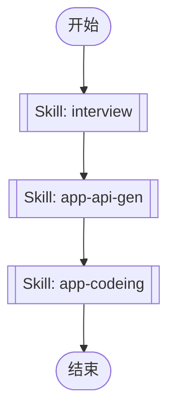

## 工作流执行指南

按照上方的Mermaid流程图执行工作流。每种节点类型的执行方法如下所述。

### 各节点类型的执行方法

- **矩形节点**：使用Task工具执行子代理
- **菱形节点（AskUserQuestion:...）**：使用AskUserQuestion工具提示用户并根据其响应进行分支
- **菱形节点（Branch/Switch:...）**：根据先前处理的结果自动分支（参见详细信息部分）
- **矩形节点（Prompt节点）**：执行下面详细信息部分中描述的提示

## Skill Nodes

#### skill_1768095891986(interview)

**Description**: This skill conducts discovery conversations to understand user intent and agree on approach before taking action. It should be used when the user explicitly calls /interview, asks for recommendations, needs exploration, wants to clarify, or when the request could be misunderstood. Prevents building the wrong thing by uncovering WHY behind WHAT.

**Scope**: project

**Validation Status**: valid

**Skill Path**: `.claude/skills/interview/SKILL.md`

This node executes a Claude Code Skill. The Skill definition is stored in the SKILL.md file at the path shown above.

#### skill_1768095903165(app-api-gen)

**Description**: "App API 代码生成技能。从后端 Swagger 文件生成 TypeScript API 客户端代码。触发场景：(1) 后端 API 更新后需要同步 (2) 新增 API 接口后生成客户端代码 (3) 需要刷新/重新生成 API 类型定义"

**Scope**: project

**Validation Status**: valid

**Allowed Tools**: Bash, Read, Glob

**Skill Path**: `.claude/skills/app-api-gen/SKILL.md`

This node executes a Claude Code Skill. The Skill definition is stored in the SKILL.md file at the path shown above.

#### skill_1768095911507(app-codeing)

**Description**: "App development skill for uni-app mobile application. Use when developing mobile pages, integrating backend APIs, implementing features with wot-design-uni components. Triggers include：(1) Creating new pages (2) Form and list development (3) API integration (4) State management (5) Component usage (6) Complete mobile app development workflow"

**Scope**: project

**Validation Status**: valid

**Skill Path**: `.claude/skills/app-codeing/SKILL.md`

This node executes a Claude Code Skill. The Skill definition is stored in the SKILL.md file at the path shown above.
